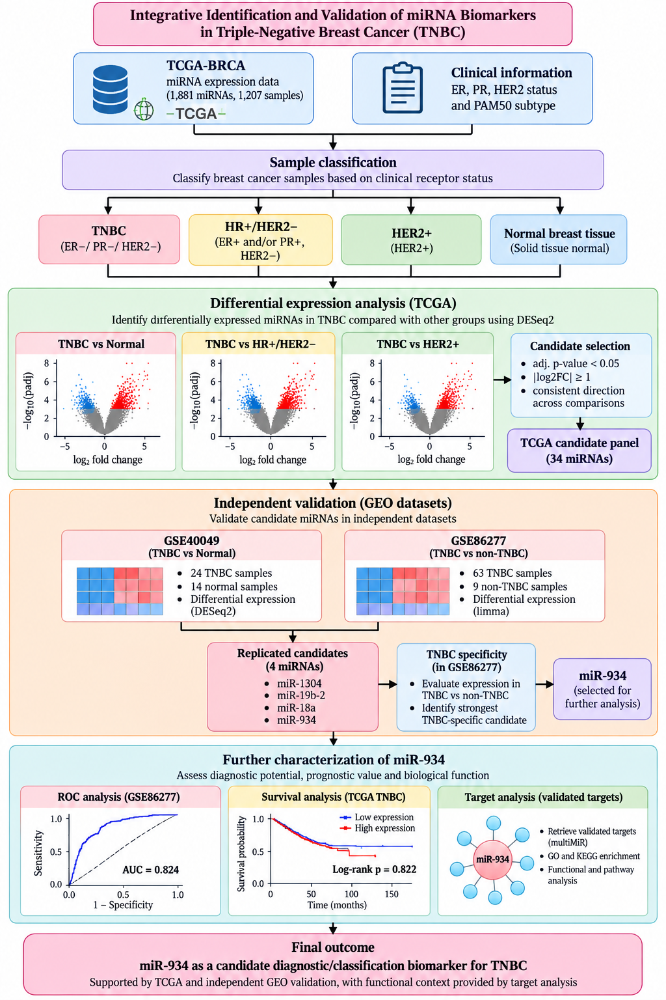
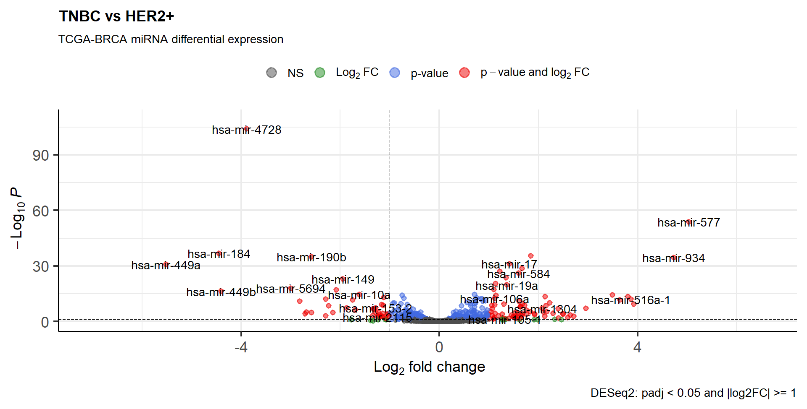
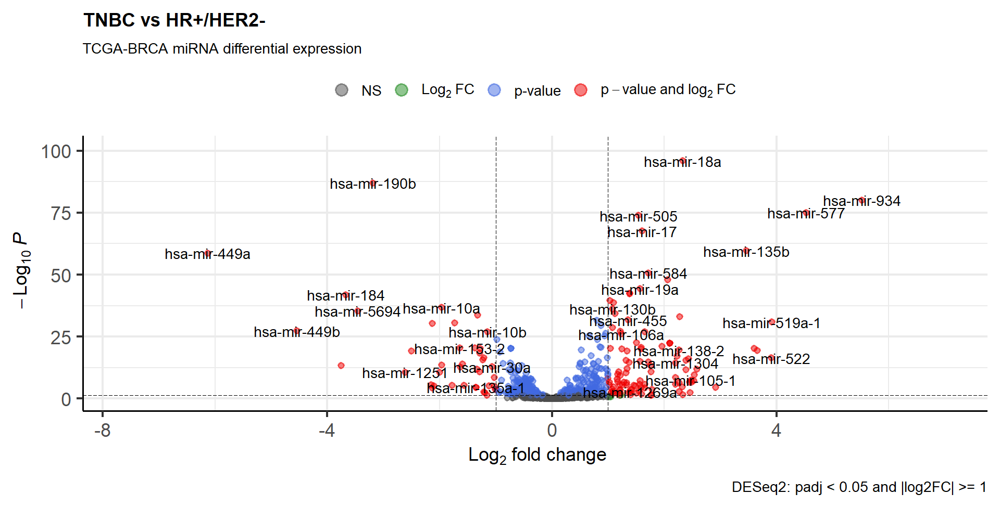
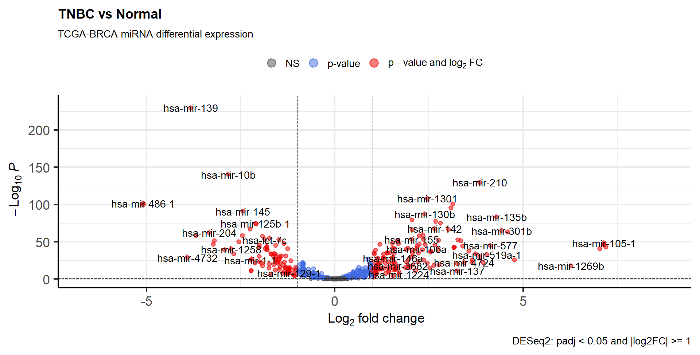
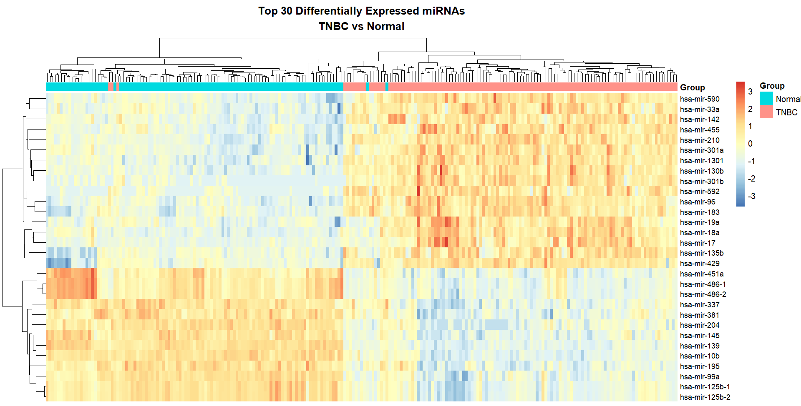
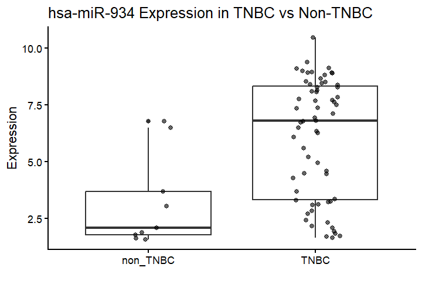
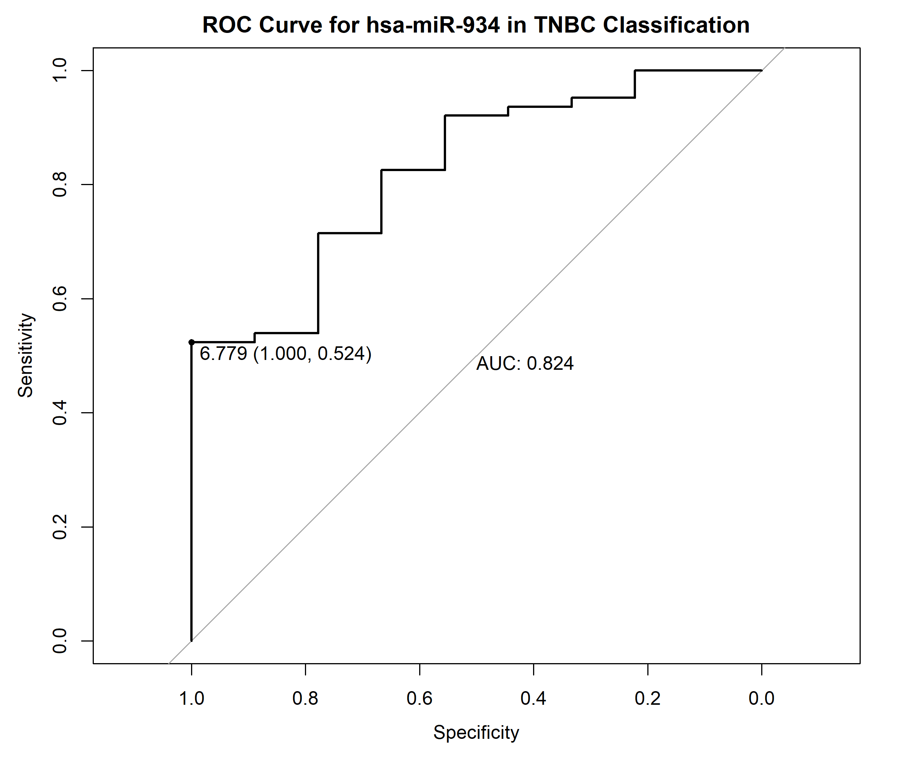
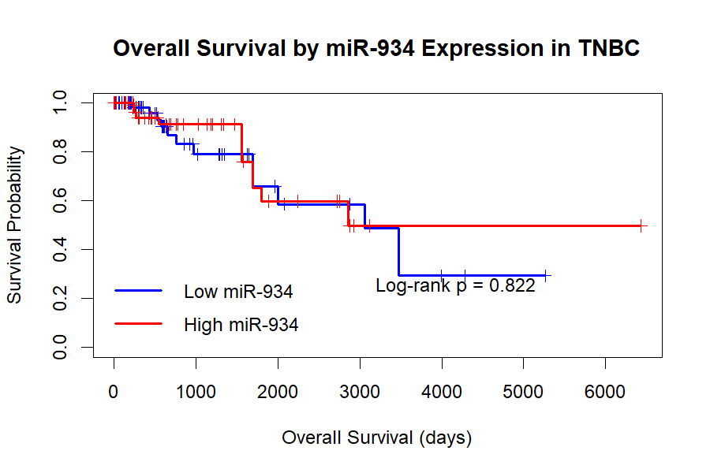
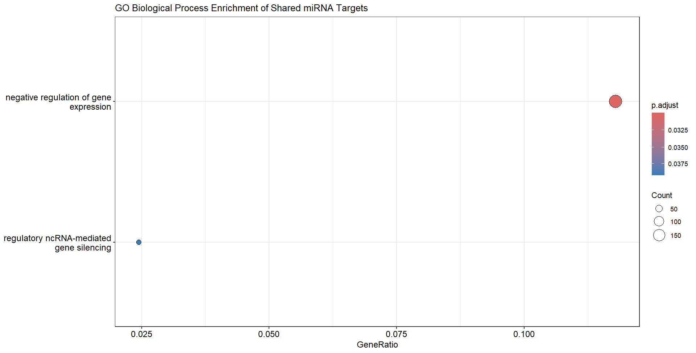
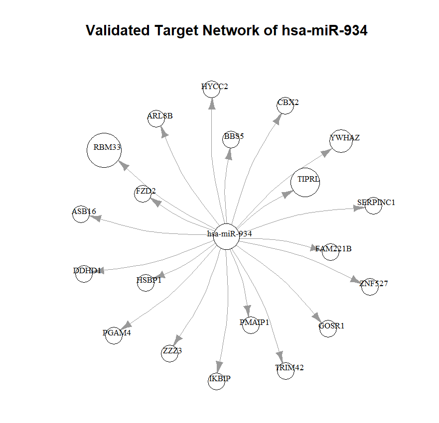

# Integrative Identification and Independent Validation of miRNA Biomarkers Associated with Triple-Negative Breast Cancer

## Project Overview

This project uses an integrative bioinformatics workflow to identify and independently validate candidate miRNA biomarkers associated with triple-negative breast cancer (TNBC) using publicly available TCGA-BRCA and GEO datasets.

The analysis combines differential miRNA expression, independent dataset validation, TNBC specificity analysis, ROC/AUC classification, survival analysis, and validated miRNA-target functional analysis.

**Lead candidate: hsa-miR-934**

**Key finding:** miR-934 showed reproducible TNBC-associated expression across independent datasets and an AUC of 0.824 in GSE86277. It was not significantly associated with overall survival in the TCGA TNBC cohort.

---

## Research Question

Can miRNAs consistently differentially expressed in TNBC across independent public datasets be identified as candidate molecular biomarkers for TNBC classification?

## Objectives

1. Identify differentially expressed miRNAs associated with TNBC.
2. Compare TNBC with normal breast tissue, HR+/HER2−, and HER2+ breast cancer.
3. Prioritize miRNAs using significance, effect size, and direction consistency.
4. Independently validate candidates using GEO datasets.
5. Evaluate the lead candidate using ROC/AUC analysis.
6. Assess association with overall survival.
7. Investigate validated miRNA-target interactions and biological processes.

---

## Analysis Workflow

```text
TCGA-BRCA miRNA expression
            ↓
Clinical ER / PR / HER2 classification
            ↓
TNBC vs Normal
TNBC vs HR+/HER2−
TNBC vs HER2+
            ↓
DESeq2 differential expression
            ↓
Robust candidate selection
            ↓
GSE40049 independent validation
            ↓
GSE86277 TNBC specificity
            ↓
Lead candidate: hsa-miR-934
            ↓
ROC / Survival / Target analysis
```

---

# Datasets

## TCGA-BRCA

TCGA-BRCA miRNA expression data were obtained using TCGAbiolinks.

The downloaded dataset contained:

- 1,881 miRNA features
- 1,207 samples

Clinical classification was based on ER, PR, and HER2 status:

- **TNBC:** ER− / PR− / HER2−
- **HR+/HER2−:** ER+ / HER2−
- **HER2+:** HER2+

Clinical TNBC classification was used rather than treating PAM50 Basal as equivalent to clinical TNBC.

## GSE40049

Independent small RNA sequencing dataset containing:

- 24 TNBC samples
- 14 adjacent normal samples

Used for independent validation of TNBC-associated miRNA expression.

## GSE86277

Independent miRNA microarray dataset used for TNBC specificity analysis.

The downloaded series matrix contained:

- 63 TNBC samples
- 9 non-TNBC samples

Because these are normalized microarray expression data, limma was used rather than DESeq2.

---

# Methods

## 1. TCGA Discovery

Differential miRNA expression was analyzed using **DESeq2** for:

1. TNBC vs Normal
2. TNBC vs HR+/HER2−
3. TNBC vs HER2+

Candidate criteria:

- Adjusted p-value < 0.05
- |log2 fold change| ≥ 1
- Consistent expression direction across comparisons

## 2. GSE40049 Validation

GSE40049 small RNA sequencing data were analyzed with DESeq2.

Replication required:

- Adjusted p-value < 0.05
- |log2FC| ≥ 1
- Same expression direction as TCGA

## 3. GSE86277 Specificity Analysis

GSE86277 microarray data were analyzed with **limma**.

The four candidates replicated in GSE40049 were tested for TNBC-associated expression relative to available non-TNBC samples.

## 4. ROC Analysis

ROC analysis was performed using **pROC** to evaluate hsa-miR-934 classification performance.

## 5. Survival Analysis

Overall survival was evaluated in the TCGA TNBC cohort using:

- Kaplan-Meier analysis
- Log-rank test
- Cox proportional hazards regression
- Proportional hazards testing

Patients were divided into high- and low-miR-934 groups using the median expression cutoff.

## 6. Target and Functional Analysis

Validated hsa-miR-934 target interactions were retrieved using **multiMiR**.

Functional analysis included:

- Gene Ontology biological-process enrichment
- Validated target analysis
- miR-934 target-network visualization

---

# Key Results

## TCGA Differential Expression

Using adjusted p-value < 0.05 and |log2FC| ≥ 1:

| Comparison | Significant miRNAs |
|---|---:|
| TNBC vs Normal | 218 |
| TNBC vs HR+/HER2− | 144 |
| TNBC vs HER2+ | 114 |

A total of **89 miRNAs** were significant in both TNBC vs HR+/HER2− and TNBC vs HER2+ comparisons.

Of these, **88 showed consistent direction of expression**.

Across all three comparisons:

- 38 miRNAs were significant.
- 34 showed consistent direction.

These 34 miRNAs formed the robust TCGA candidate set.

## Independent GSE40049 Validation

Four candidates were independently replicated:

| miRNA | TCGA log2FC | GSE40049 log2FC | Adjusted p-value |
|---|---:|---:|---:|
| hsa-mir-1304 | +1.54 | ~+2.88 | 4.16 × 10⁻⁶ |
| hsa-mir-19b-2 | +1.21 | ~+1.59 | 0.00473 |
| hsa-mir-18a | +2.80 | ~+1.35 | 0.0395 |
| **hsa-mir-934** | **+3.56** | **~+1.79** | **0.0338** |

## GSE86277 TNBC Specificity

| Candidate | logFC | Adjusted p-value |
|---|---:|---:|
| **hsa-miR-934** | **+2.873** | **0.0104** |
| hsa-miR-18a | +1.10 | 0.0867 |
| hsa-miR-1304 | +0.24 | 0.2600 |
| hsa-mir-19b-2 | ~0 | ~0.991 |

hsa-miR-934 was therefore selected as the lead candidate.

## ROC Performance

**AUC = 0.824**

95% CI: **0.689–0.959**

At the optimal Youden threshold:

- Sensitivity = 52.4%
- Specificity = 100%

The result supports potential TNBC classification ability in this dataset, but the small non-TNBC group limits the strength of the estimate.

## Survival Analysis

The TCGA TNBC survival cohort contained:

- 135 patients
- 24 observed deaths
- 111 censored observations

Results:

- Log-rank p = **0.822**
- Cox HR = **0.912**
- 95% CI = **0.401–2.075**
- Cox p = **0.827**
- PH assumption p = **0.74**

No significant overall-survival association was observed.

Therefore, miR-934 was **not supported as a prognostic biomarker** in this analysis.

## Functional Analysis

Validated miR-934 target analysis identified **55 unique validated target genes**.

The broader shared-target analysis showed significant enrichment for:

- Negative regulation of gene expression
- Regulatory ncRNA-mediated gene silencing

KEGG analysis did not retain statistically significant pathways after FDR correction.

---

# Figures

## Figure 1 — Methodology Workflow



## Figure 2 — TCGA Volcano Plots







## Figure 3 — TCGA miRNA Heatmap



## Figure 4 — miR-934 TNBC Specificity



## Figure 5 — miR-934 ROC Curve



## Figure 6 — miR-934 Survival Analysis



## Figure 7 — GO Enrichment



## Figure 8 — miR-934 Target Network



---

# Repository Structure

```text
tnbc-mirna-biomarker-analysis/
│
├── README.md
├── Docs/
│   ├── Methodology.md
│   └── Results.md
├── Figures/
│   ├── Figure_1_Methodology_Workflow.png
│   ├── Figure_2.1_TCGA_Volcano_Plots.png
│   ├── Figure_2.2_TCGA_Volcano_Plots.png
│   ├── Figure_2.3_TCGA_Volcano_Plots.png
│   ├── Figure_3_TCGA_miRNA_Heatmap.png
│   ├── Figure_4_miR934_TNBC_Specificity.png
│   ├── Figure_5_miR934_ROC_Curve.png
│   ├── Figure_6_miR934_Survival_Analysis.png
│   ├── Figure_7_GO_Enrichment_Shared_Targets.png
│   └── Figure_8_miR934_Target_Network.png
├── R/
│   ├── 01_TCGA_Discovery.R
│   ├── 02_GEO_Validation.R
│   ├── 03_Survival_Analysis.R
│   └── 04_miR934_Target_Analysis.R
└── Results/
    ├── TCGA_Candidate_miRNAs.csv
    ├── GEO_Replicated_Candidates.csv
    ├── miR934_ROC_Results.csv
    ├── miR934_Survival_Results.csv
    └── miR934_Validated_Targets.csv
```

---

# Analysis Code

- [TCGA Discovery](R/01_TCGA_Discovery.R)
- [GEO Validation](R/02_GEO_Validation.R)
- [Survival Analysis](R/03_Survival_Analysis.R)
- [miR-934 Target Analysis](R/04_miR934_Target_Analysis.R)

# Results Tables

- [TCGA Candidate miRNAs](Results/TCGA_Candidate_miRNAs.csv)
- [GEO Replicated Candidates](Results/GEO_Replicated_Candidates.csv)
- [miR-934 ROC Results](Results/miR934_ROC_Results.csv)
- [miR-934 Survival Results](Results/miR934_Survival_Results.csv)
- [miR-934 Validated Targets](Results/miR934_Validated_Targets.csv)

# Documentation

- [Methodology](Docs/Methodology.md)
- [Results](Docs/Results.md)

---

# Major R Packages

`TCGAbiolinks` · `DESeq2` · `GEOquery` · `limma` · `miRBaseConverter` · `multiMiR` · `clusterProfiler` · `org.Hs.eg.db` · `pROC` · `survival` · `survminer` · `pheatmap` · `EnhancedVolcano` · `igraph`

---

# Interpretation

The integrated analysis identified miRNAs associated with TNBC across multiple TCGA comparisons and independent GEO datasets.

hsa-miR-934 was prioritized because it:

1. Was significantly differentially expressed across the three TCGA comparisons.
2. Showed consistent expression direction.
3. Was independently replicated in GSE40049.
4. Showed significant TNBC enrichment in GSE86277.
5. Demonstrated an AUC of 0.824 for TNBC classification.

Survival analysis did not support a prognostic role.

Therefore, hsa-miR-934 is presented as a **candidate TNBC classification/diagnostic biomarker**, not a validated prognostic biomarker.

---

# Limitations

- Public retrospective datasets were used.
- Dataset platforms and experimental designs differ.
- GSE86277 contained only 9 available non-TNBC samples in the downloaded series matrix.
- The TCGA survival analysis included only 24 observed death events.
- No experimental validation was performed.
- Clinical diagnostic utility cannot be established from this analysis.
- miR-934 has been previously investigated in TNBC; this project does not claim first discovery or novelty of miR-934 itself.

---

# Conclusion

This project demonstrates a reproducible multi-dataset bioinformatics workflow for TNBC miRNA biomarker investigation.

TCGA discovery followed by independent GEO validation narrowed the candidate set and prioritized **hsa-miR-934**. miR-934 showed TNBC-associated expression and an AUC of **0.824** in an independent specificity dataset, while survival analysis did not support a prognostic association.

Overall, hsa-miR-934 represents a **computationally supported candidate biomarker for TNBC classification that requires further validation in larger independent cohorts and experimental studies**.

---

# Data Sources

- **TCGA-BRCA:** Genomic Data Commons
- **GSE40049:** Gene Expression Omnibus
- **GSE86277:** Gene Expression Omnibus

## References

Love MI, Huber W, Anders S. Moderated estimation of fold change and dispersion for RNA-seq data with DESeq2. *Genome Biology*. 2014;15:550.

Smyth GK. limma: Linear Models for Microarray and Omics Data.

Major software resources used include TCGAbiolinks, GEOquery, multiMiR, clusterProfiler, pROC, survival, and related R/Bioconductor packages.

---

# Author

**Aarkin Nanda**  
M.Sc. Biotechnology

This repository represents an independent computational analysis using publicly available datasets.

## Disclaimer

This project is intended for research and educational purposes. The computational findings do not constitute a clinical diagnostic or prognostic test. Further independent and experimental validation is required before clinical interpretation.
